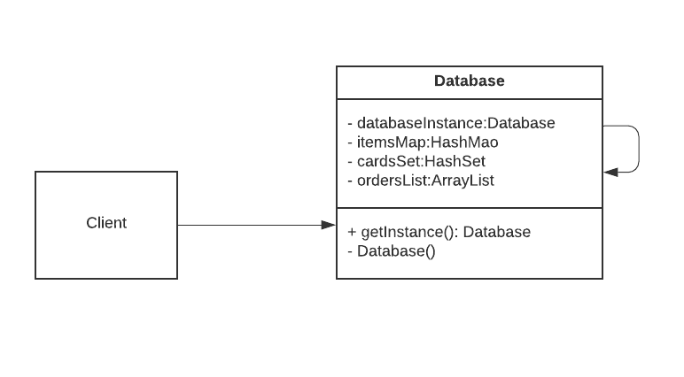
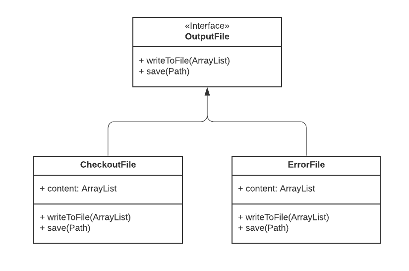
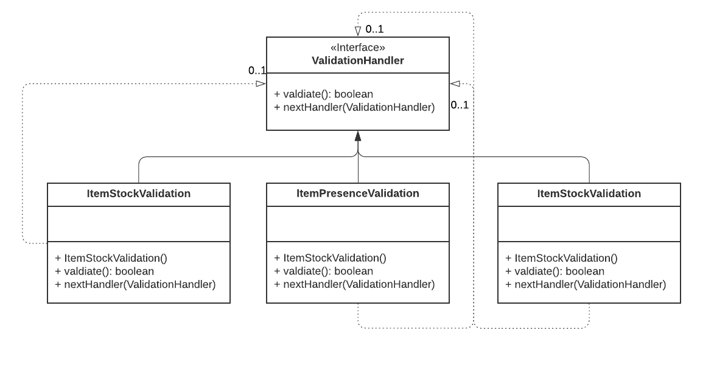
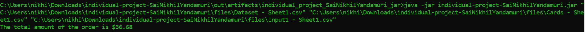
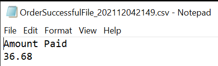
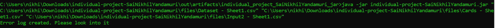
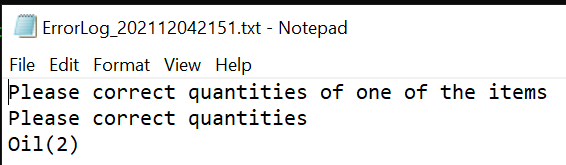
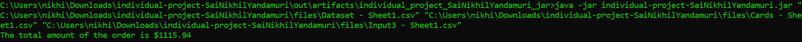
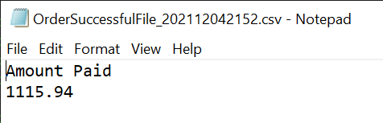

# individual-project-SaiNikhilYandamuri

## Problem Statement
We will develop a Marketplace application having the information of the inventory and users are allowed to purchase products by making products. There are a limited number of items in the inventory. There will be a cap on the quantity of items purchased from each category. If an order satisfies all the requirements, the total amount paid will be calculated and credit card details will be used to make the payment. 

## Design Patterns:
- Singleton
- Factory
- Chains of Responsibility

### Singleton:
- It is creational design pattern that lets you ensure that a class has only one instance, while providing the global access point to this instance.
- This pattern is used to build the database for the application. Only the Database class is used as part of this pattern.
- Whenever an instance of the database is needed, the getIntance() method is called so that only one instance of the object can be reused.

### Factory:
- It is a creational design pattern that provides an interface for creating objects in a superclass, but allows subcasses to alter the type of objects that will be created. 
- We have used this pattern to output when an order is processed. The following files are as part of this pattern implementation: 
     - Interface OutputFile
     - Class CheckoutFile
     - Class ErrorFile
- When the respective concrete handler figures out the output should be a checkout file or error file, we will create an object of OutputFile. The FileReader class is used to read and create files in the application.

### Chains of Responsilibilty:
- It is a behavioral design pattern that lets you pass requests along a chain of handlers. Upon receiving a request, each handler decided either to process the request or to pass it to the next handler in the chain.
- We have used this design pattern to determine if the order can be processed correctly or not. The following files are used in this pattern:
     - Interface ValidationHandler
     - Class ItemPresenceValidation
     - Class ItemStockValidation
     - Class ItemCategoryCapValidation
- Before we verify the order can be processed or not, ValidationHandler object is created and will be passed on from one Handler to another using the same.

## Instructions to run the application:

Needs Java 8 installed in the system that is running the program.

### Instructions to run the JAR file:
- Opem Command Prompt in the location of JAR File.  (Location of JAR File is: `<Present Directory>\out\artifacts\individual_project_SaiNikhilYandamuri_jar\individual-project-SaiNikhilYandamuri.jar)`. 
- Run the following command in the command prompt:
`java -jar <jar_name> "<Dataset File Path>" "<Card Information File Path>" "<Order Information File Path>"`  
For Example:  
`java -jar individual-project-SaiNikhilYandamuri.jar "<Dataset File Path>" "<Card Information File Path>" "<Order Information File Path>"`
- Output files will be created in the directory as the files provided as arguments to run the JAR. 
     
## Screenshots of Test Cases:

### Test Case 1: 

#### Input:

     
#### Output:

### Test Case 2: 

#### Input:

     
#### Output:

### Test Case 3: 

#### Input:

     
#### Output:

